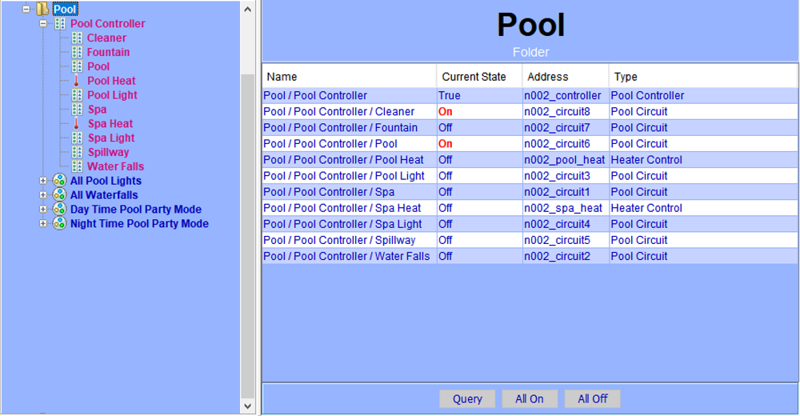
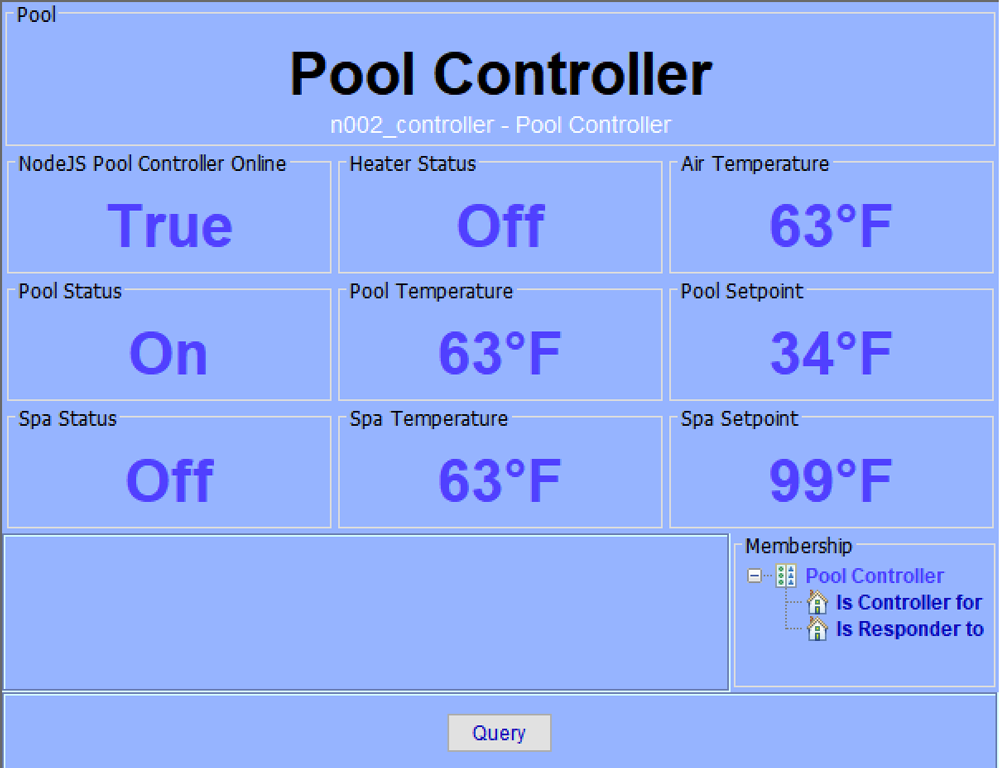
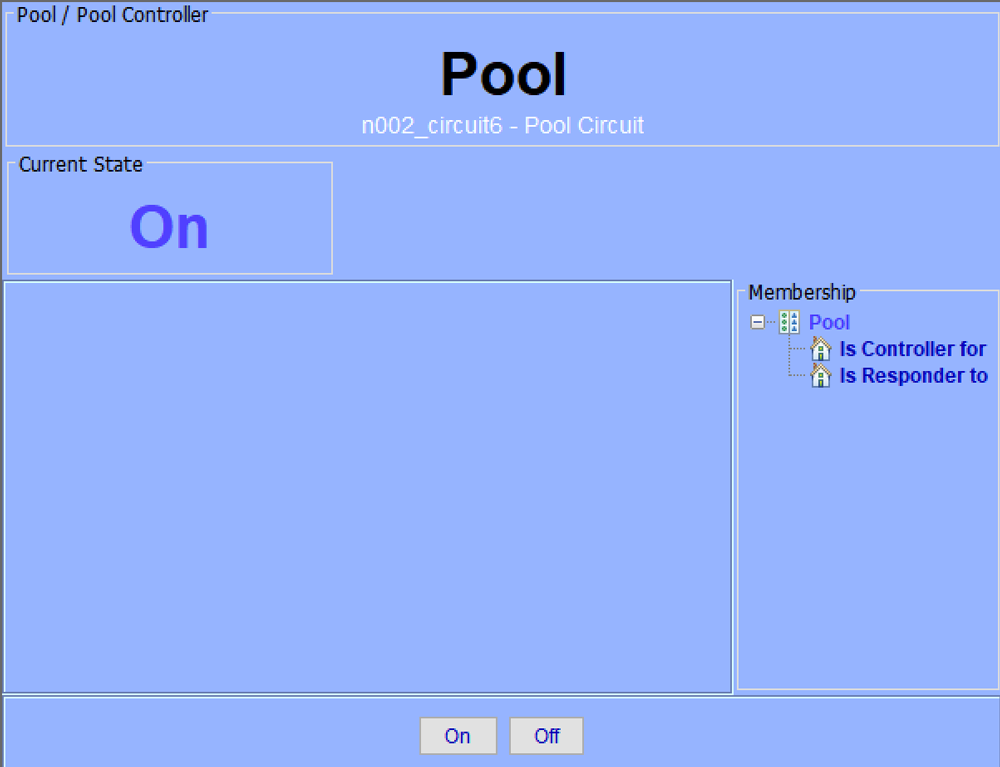
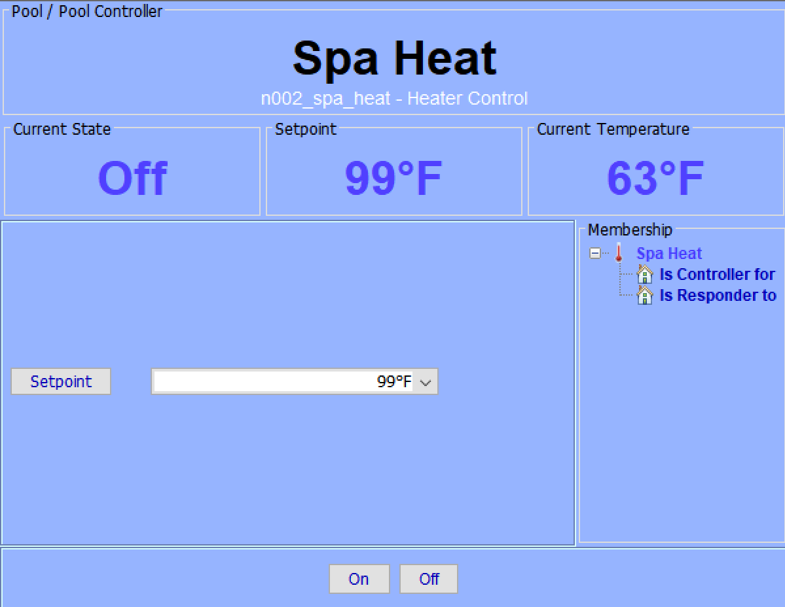
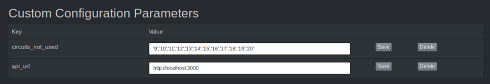

# nodejs-poolController for Polyglot V2
This is a Nodeserver for Polyglot v2 that interfaces with the [NodeJs Pool Controller application](https://github.com/tagyoureit/nodejs-poolController) allowing the ISY 994i to control your Pentair pool equipment.

[](./screenshots/01-controller-folder.png)

[](./screenshots/02-controller-node.png)

[](./screenshots/03-circuit-node.png)

[](./screenshots/04-heat-node.png)

#### Installation

1. First install [Polyglot V2](https://github.com/UniversalDevicesInc/polyglot-v2) and [nodejs-poolController](https://github.com/tagyoureit/nodejs-poolController) if you haven't already
2. Clone or copy the files from this repository into the folder ~/.polyglot/nodeservers/nodejs-pool-controller-polyglotv2
3. Log into the Polyglot V2 Dashboard and navigate to "Nodeservers" > "Add Nodeserver"
5. Choose the "Local (Co-resident with Polyglot)" node server type then choose "Pool" in the from the available node servers
7. Navigate to the "Dashboard", then choose "Details" on the Pool NodeServer, then choose "Configuration" and add the base url to your nodejs-poolController application installation as a "Custom Configuration Parameter" with a key of "api_url"
```
api_url: http://localhost:3000
```
8. There are 20 circuits available from nodejs-poolController and if you're not using them all you can list all the unused circuit ids to avoid having them inserted in as nodes. To do this add a "Custom Configuration Parameter" with a key of "circuits_not_used"
```
circuits_not_used: '9','10','11','12','13','14','15','16','17','18','19','20'
```
9. Restart the NodeServer

[](./screenshots/05-polyglot-configuration.png)
